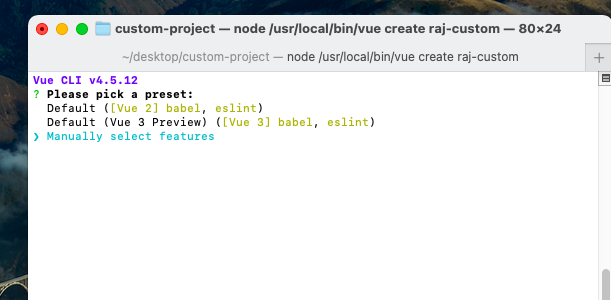
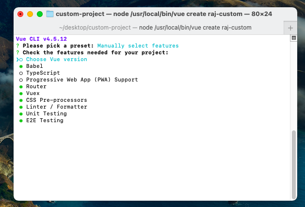
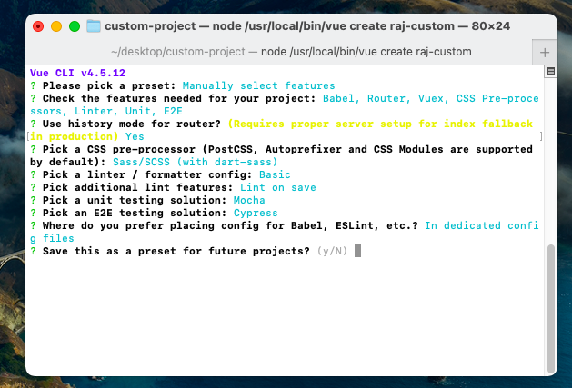

## How to custom preset Vuejs project? ##
- Custom preset allow us to create our own custom project with required file

## 1. How to create custom VueJS project? ##
- goto terminal and type vue create raj-custom


## 2. Select project manally ##


## 3. Select the fatures that you need ##


## 4. Select css processor ##

-don't forget to select browser history

## 5. Select linter and formatting ##


-lintter will lint the project on the basis of commit or save


## Save project for the future ##


- we can extract this preset from CLI later 

# Diagnosis of the project #

## 1. babel.config.js ##
- The babel.config.js allows to use the next generation javascript feature which is not currently supported by some browser.

package.json has

```js
"browserlist": ["
                    > 1%
                    last 2 versions
                    not dead
                "]
```

In this case this file is located inside browserlistrc

