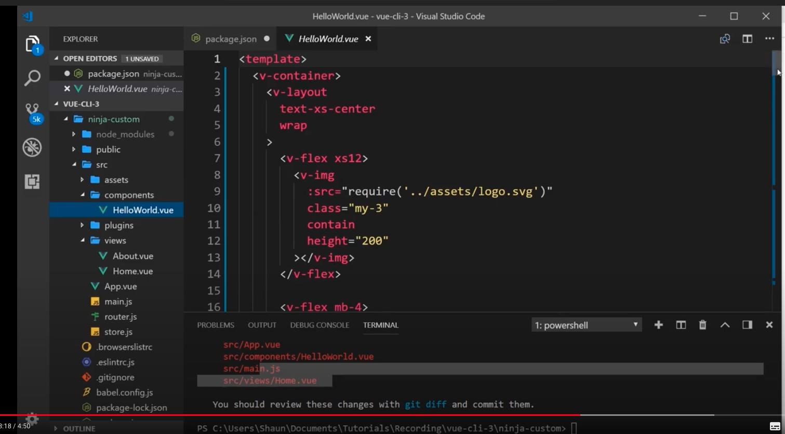

## What is Vue CLI plugin ##
- Vue CLI uses a plugin-based architecture. If you inspect a newly created project's package.json, you will find dependencies that start with @vue/cli-plugin-. Plugins can modify the internal webpack configuration and inject commands to vue-cli-service. Most of the features listed during the project creation process are implemented as plugins.

## Location of Vue Cli Plugin ##
```js
"devDependencies": {
    "@vue/cli-plugin-babel": "~4.5.0",
    "@vue/cli-plugin-e2e-cypress": "~4.5.0",
    "@vue/cli-plugin-eslint": "~4.5.0",
    "@vue/cli-plugin-router": "~4.5.0",
    "@vue/cli-plugin-unit-mocha": "~4.5.0",
    "@vue/cli-plugin-vuex": "~4.5.0"
  }
  ```

## Adding plugin to the existing project ##
```js
vue add eslint
```

## Adding plugin in VueJs ##
```js
vue add vuetify
```

- note vuetify plugin allows us to easily design component with material design look

- After adding vuetify plugin if we checked our project then we can see that 


all the existing component is modified to incorporate material design