## How to deploy to firebase freely ##

### 1. Goto Google firebase ###
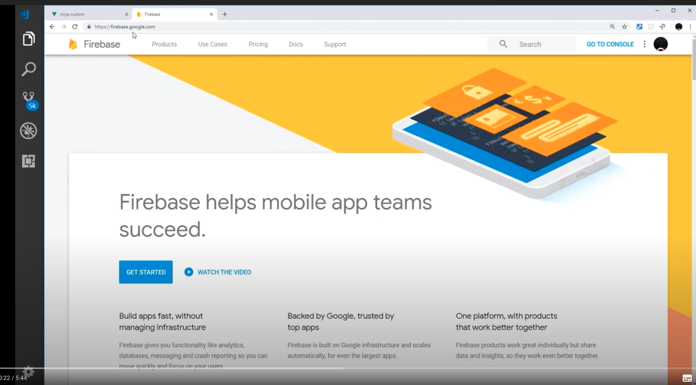

### 2. Add project ###
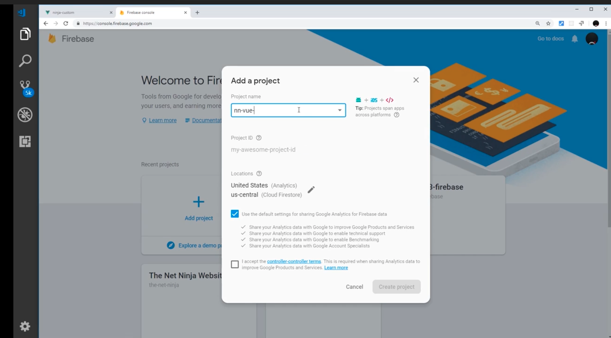

### 3. Install firebase plugin ###
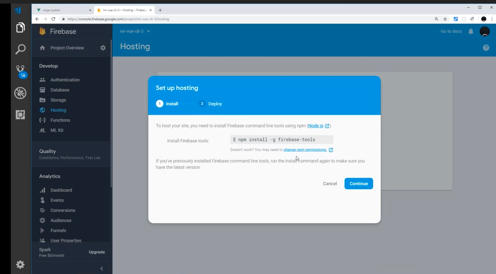

### 4. Initialize firebase plugin ###
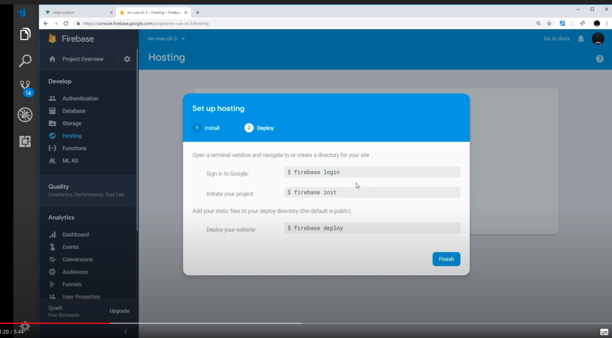
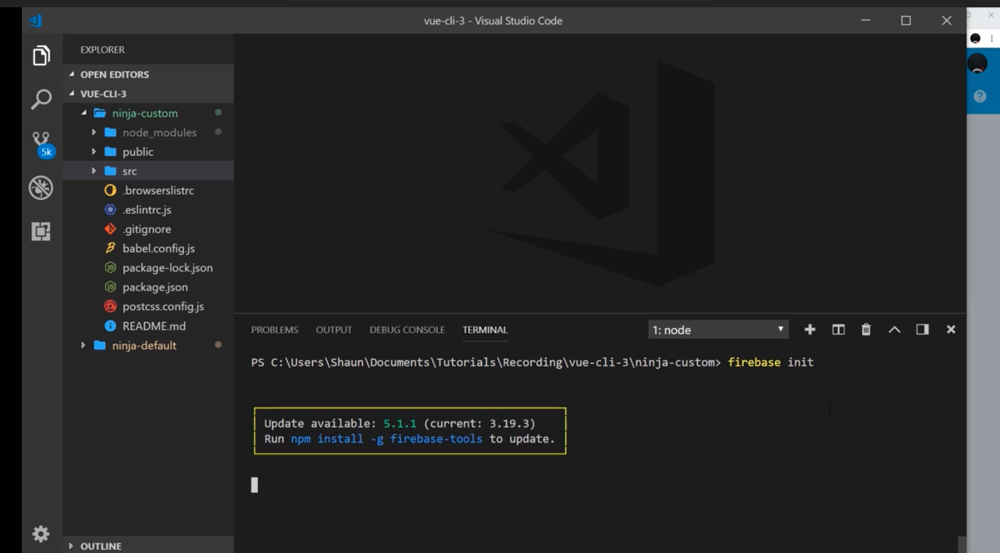

### 5. Confirm you want to proceed ###
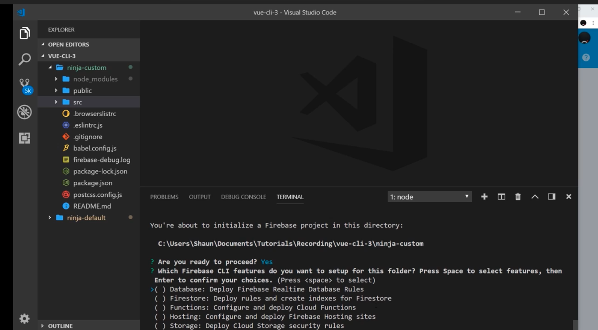

### 6. Confirm firebase hosting ###
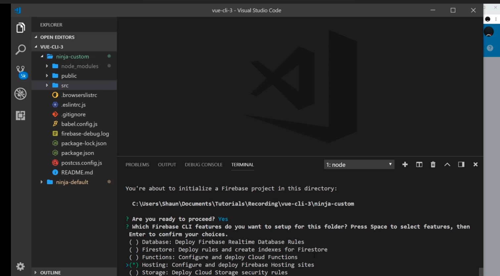

### 7. Confirm firebase project ###
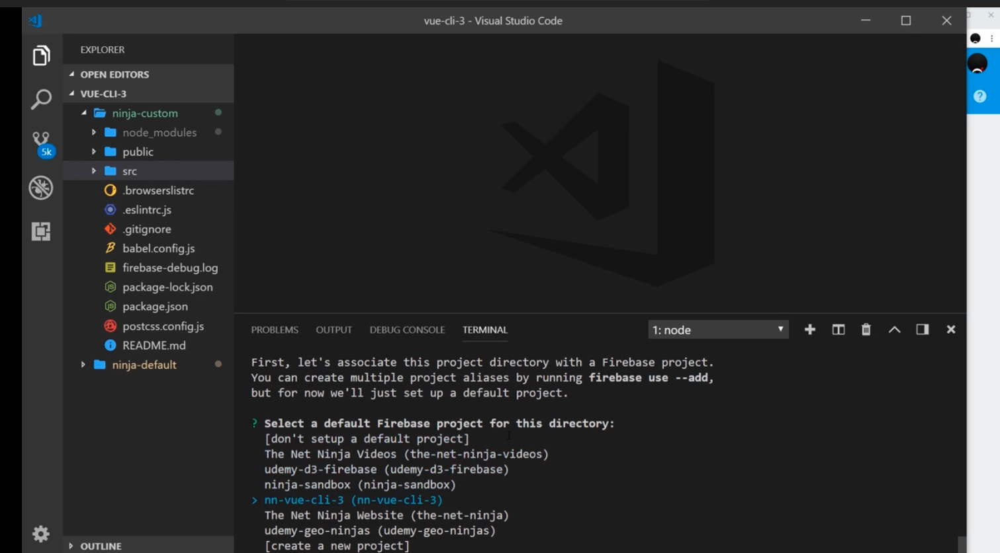

### 8. Firebase use default public but make it dist ###
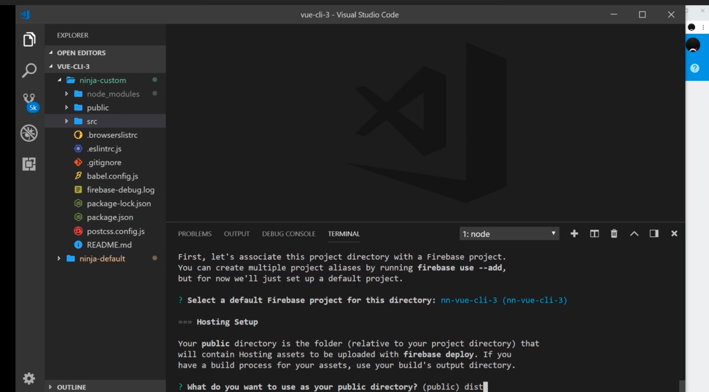

### 9. Configure your app as a single page app ###
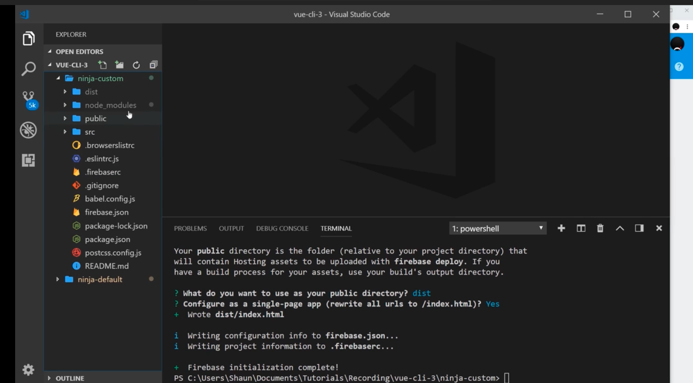

### 10. Build project ###
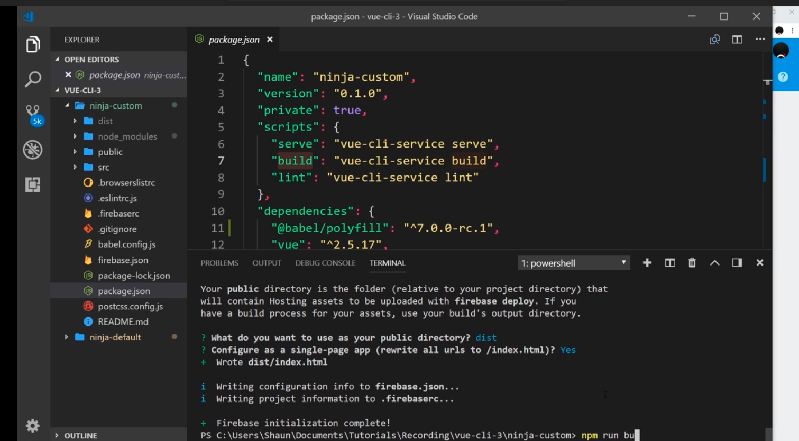

### 11. Perform Firebase only hosting ###
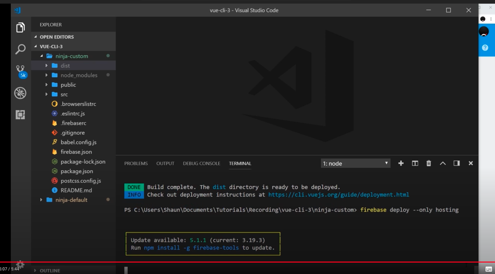

# Reference #
- https://www.youtube.com/watch?v=HqThxPmBGlI&list=PL4cUxeGkcC9iCKx06qSncuvEPZ7x1UnKD&index=6
