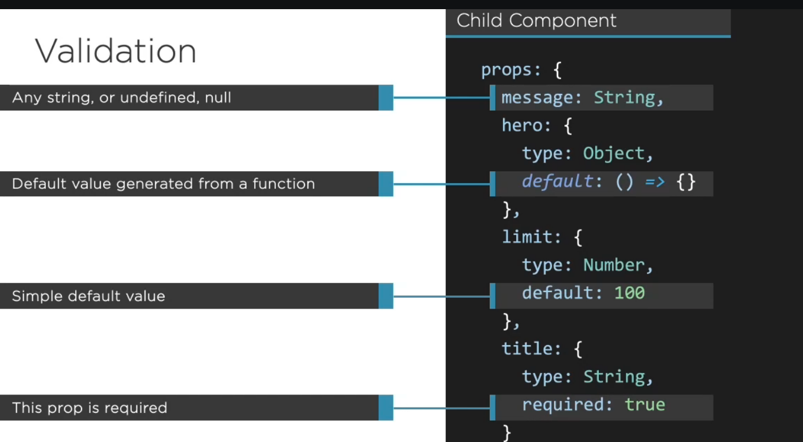
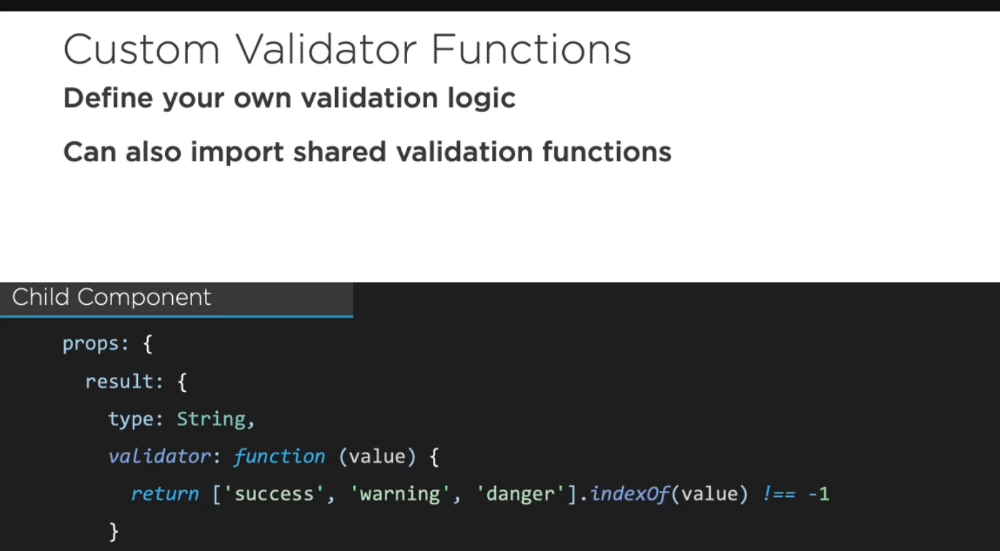
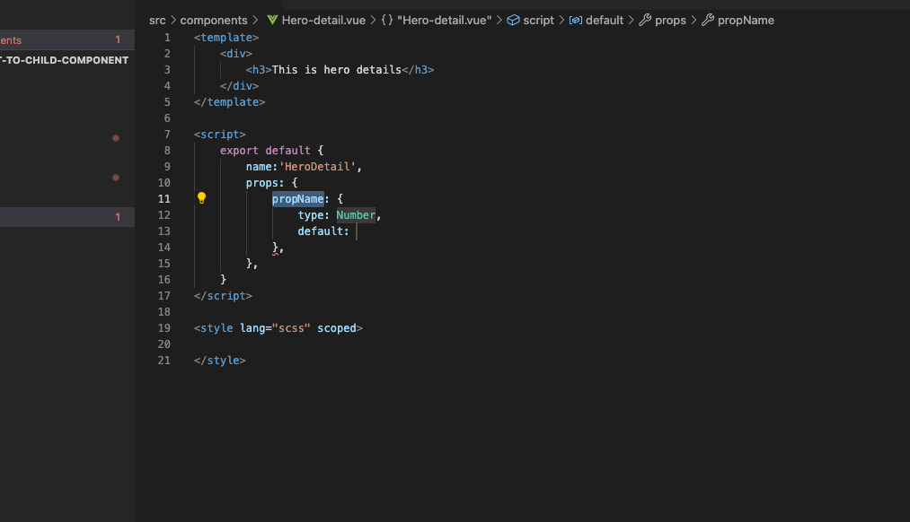
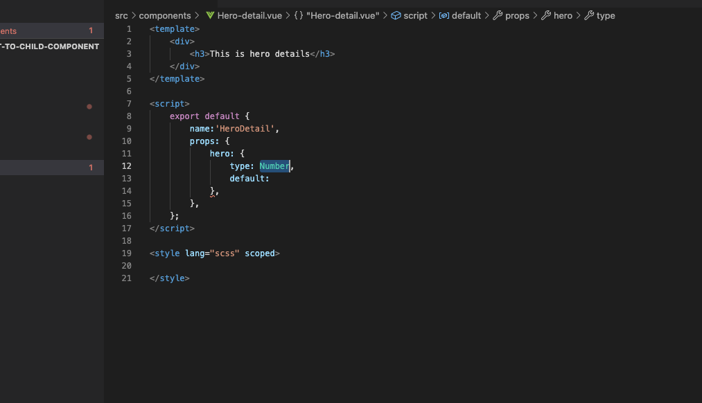
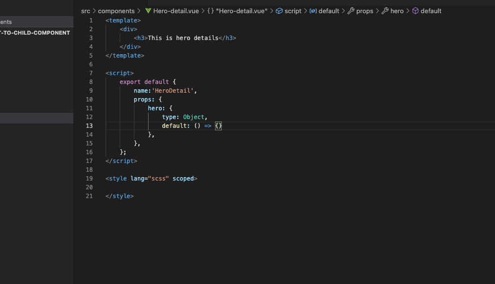

## Passing value from parent component to child component ##
- we can pass value from parent component to child component using <b>props</b>

- Tips for using props

- Validation in props

- Custom validation in props

## Short cut for creating props in Vue component ##

- shortcut for creating props

- provide name for props

- Define the type of the prop

- It is object

- default implementation is object

