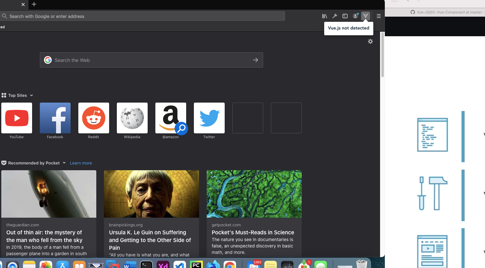

## How to install Vue dev tools in as a browser extension ##

# List of the Vue development tools #
- Short cut for vue component generation: <a href="1. short-cut-for-vue-component.MD">Click here</a>
- How to check vue on browser: <a href="2. how-to-check-vue-on-browser.MD">Click here</a>
- Visual studio tip: <a href="3. Visual-Studio.MD">Click here</a>
- Component registration issue (component registered but not used): <a href="4. Component-registration-Issue-Not-found.MD">Click here</a>