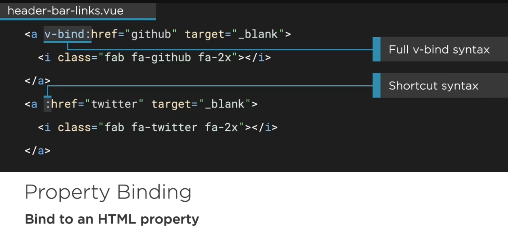
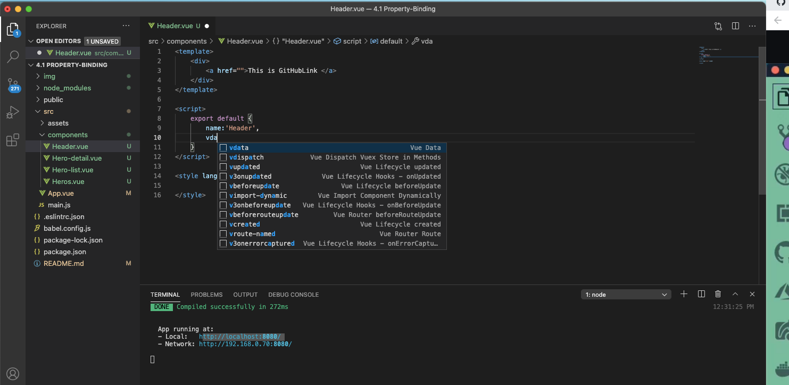
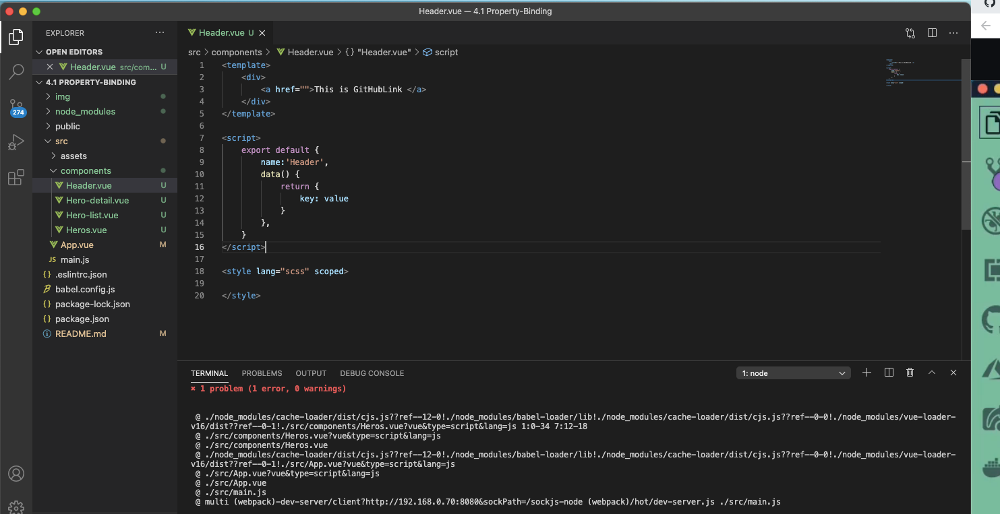
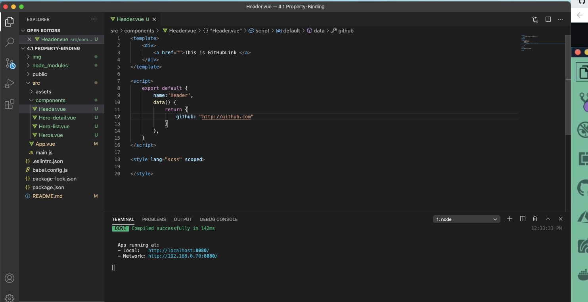

## Property binding in VueJs ##
- Property binding manipulates or assigns values to HTML attributes, change the style, and assign classes with the help of binding directive called v-bind available with VueJS




## How to generate data is VueJs ##

- type vdata to generate data section


- If you don't generate key value pair you will get error


- Provide key value pair

## Property binding in Header ## 
```js
<template>
    <div>
        <a :href="github">This is GitHubLink </a>
        <a v-bind:href="twitter">This is Twitter </a>
    </div>
</template>

<script>
    export default {
        name:'Header',
        data() {
            return {
                github: "http://github.com",
                twitter:"http://twitter.com"
            }
        },
    }
</script>

<style lang="scss" scoped>

</style>
```

# Reference 
- https://www.tutorialspoint.com/vuejs/vuejs_binding.htm