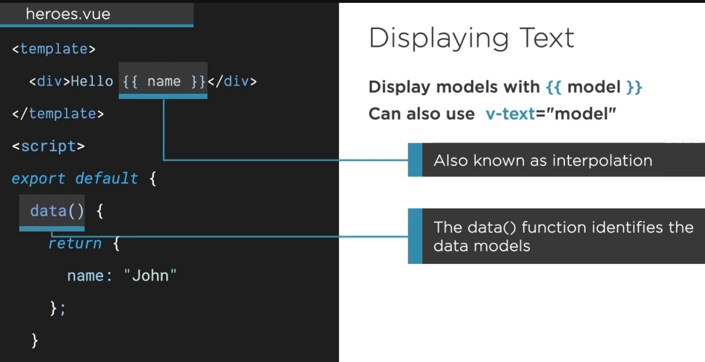

## Property String Interpolation in VueJs ##
- String interpolation (or variable interpolation, variable substitution, or variable expansion) is the process of evaluating a string literal containing one or more placeholders, yielding a result in which the placeholders are replaced with their corresponding values.




## How to use String interpolation ##
```js
<template>
    <div>
        <h3>{{heroTitle}}</h3>
        <h4> Hero First Name: {{hero.firstName}} </h4>
        <h4> Hero Last Name: {{hero.lastName}} </h4>
        <h4> Hero id: {{hero.id}} </h4>
    </div>
</template>

<script>
    export default {
        name:'HeroDetail',
        data() {
            return {
                heroTitle: "This is hero details",
                hero:{
                    id:20,
                    firstName:"Raj",
                    lastName:"Bhatta"
                }
            }
        },
    }
</script>

<style lang="scss" scoped>

</style>
```

# Reference 
- https://www.tutorialspoint.com/vuejs/vuejs_binding.htm