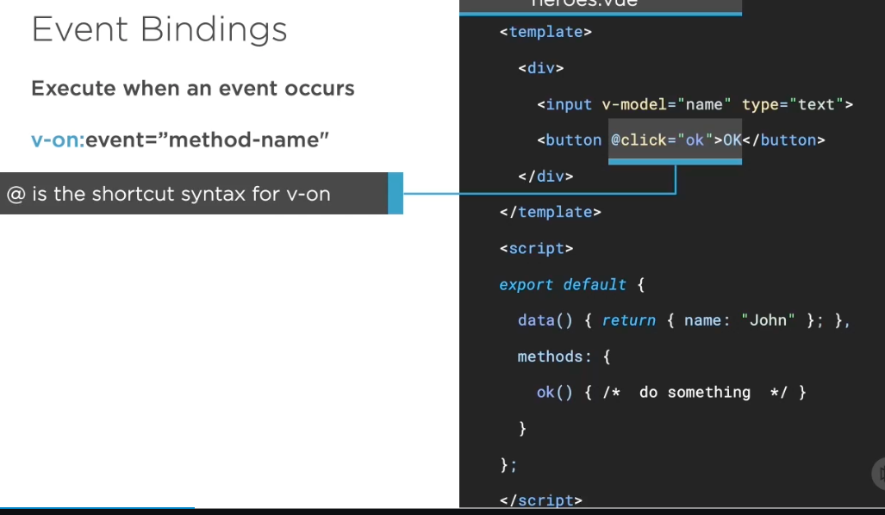
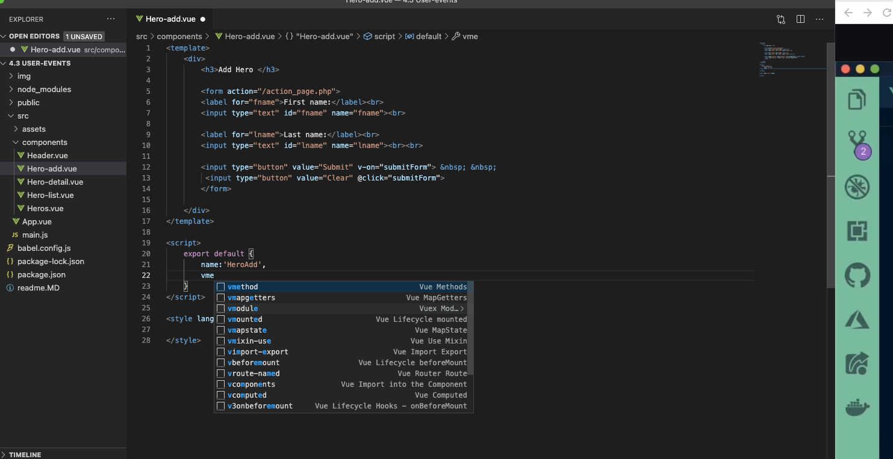
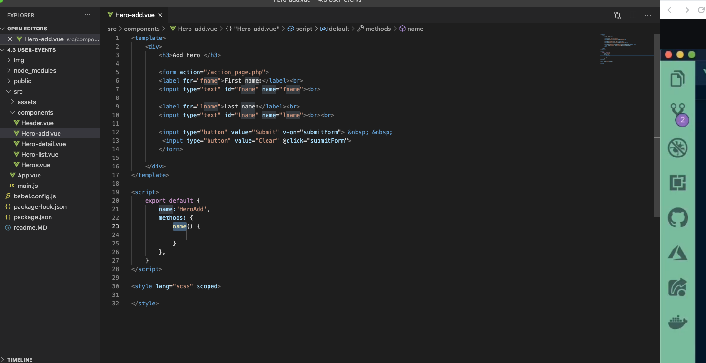

## User event in VueJs ##

v-on is the attribute added to the DOM elements to listen to the events in VueJS.

The following code is used to assign a click event for the DOM element.
```js
<button v-on:click = "displaynumbers">Click ME</button>
```
There is a shorthand for v-on, which means we can also call the event as follows −

```js
<button @click = "displaynumbers">Click ME</button>
```

# 1. Example of User Events #
```js
<template>
    <div>
        <h3>Add Hero </h3>

        <form>
        <label for="fname">First name:</label><br>
        <input type="text" id="fname" name="fname"><br>

        <label for="lname">Last name:</label><br>
        <input type="text" id="lname" name="lname"><br><br>

        <input type="button" value="Submit" v-on:click="submitForm"> &nbsp; &nbsp;
         <input type="button" value="Clear" @click="clearForm">
        </form>

    </div>
</template>

<script>
    export default {
        name:'HeroAdd',
        methods: {
            submitForm() {
                alert('hello submit form button is clicked');
            },
            clearForm(){
                alert('hello clear button is clicked');
            }
        },
    }
</script>

<style lang="scss" scoped>

</style>
```

# 2. Example of attaching value to data variable #
```js
<template>
    <div>
        <h3>Add Hero </h3>

        <form>
        <label for="fname">First name:</label><br>
        <input type="text" id="fname" name="fname"><br>

        <label for="lname">Last name:</label><br>
        <input type="text" id="lname" name="lname"><br><br>

        <input type="button" value="Submit" v-on:click="submitForm"> &nbsp; &nbsp;
         <input type="button" value="Clear" @click="clearForm">
        </form>

        <h1>Event {{message}}</h1>
    </div>
</template>

<script>
    export default {
        name:'HeroAdd',
        data() {
            return {
                message: ""
            }
        },
        methods: {
            submitForm() {
                this.message="Submit Form button is clicked";
            },
            clearForm(){
                this.message="Clear Form button is clicked";
            }
        },
    }
</script>

<style lang="scss" scoped>

</style>
```

# 3. Creating method using vmethod #




## Reference ##
- https://www.tutorialspoint.com/vuejs/vuejs_events.htm