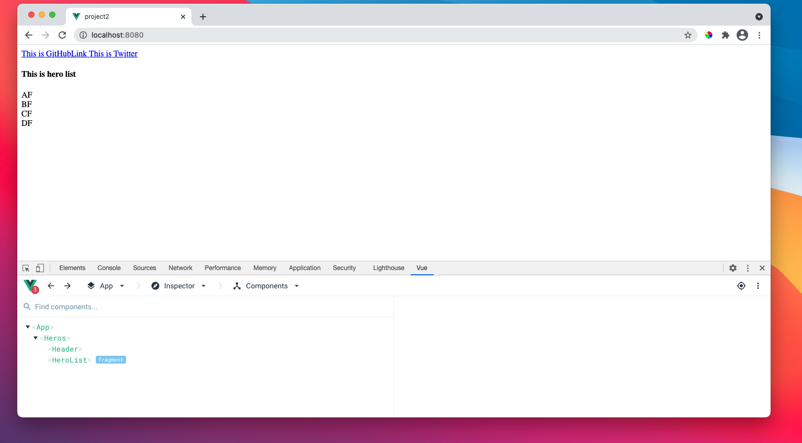
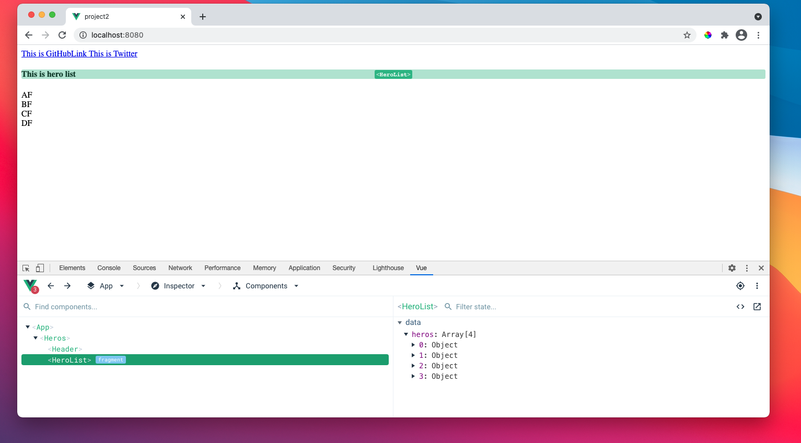
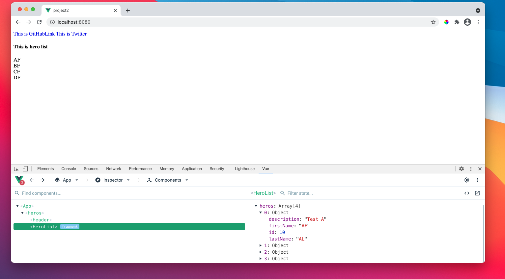

## Defining data model in Vue ##
- data model is the data that we will bind with the view.

```js
<template>
    <h4>This is hero list</h4>
    
    <div v-for="hero in heros" :key="hero.id">
        {{hero.firstName}}
    </div>

</template>

<script>
    const OUR_HEROES=[
        {
            id:10,
            firstName:"AF",
            lastName: "AL",
            description:"Test A"
        },
        {
            id:11,
            firstName:"BF",
            lastName: "BL",
            description:"Test B"
        },
        {
            id:12,
            firstName:"CF",
            lastName: "CL",
            description:"Test C"
        },
        {
            id:13,
            firstName:"DF",
            lastName: "DL",
            description:"Test D"
        }
    ];

    export default {
        name:'HeroList',
        data() {
            return {
                heros: OUR_HEROES
            }
        },
    }
</script>

<style lang="scss" scoped>

</style>
```

# 1. How to inspect data in browser with Vue dev extension #

<br/>

