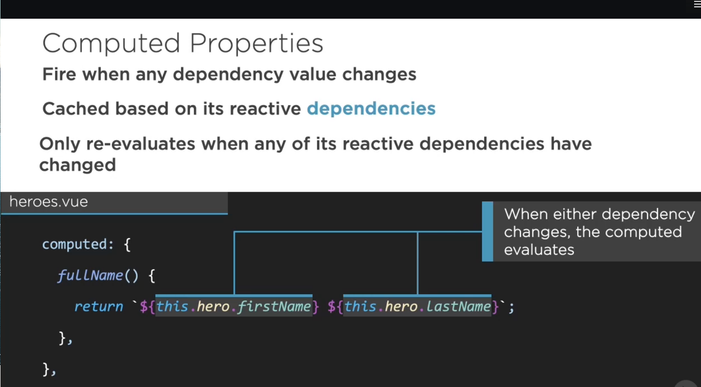
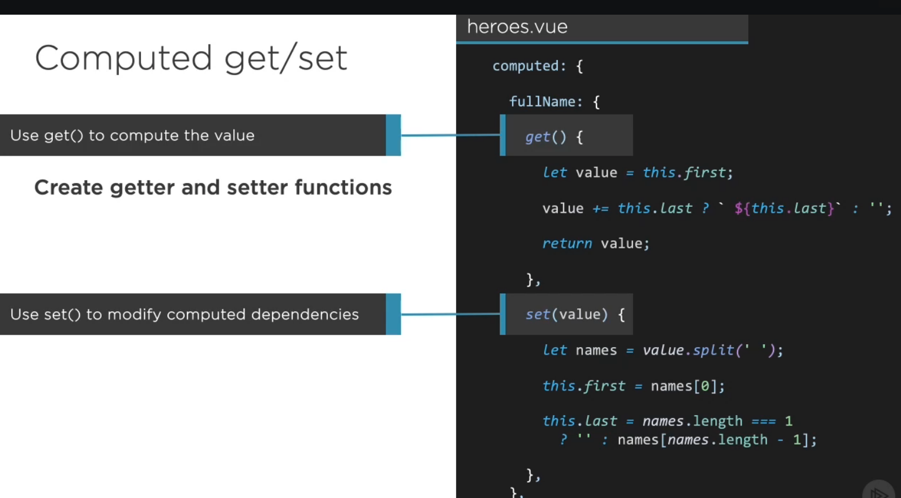

## 1. What is computed properties in VueJs ##
Computed properties are very valuable for manipulating data that already exists. Anytime you’re building something where you need to sort through a large group of data and you don’t want to rerun those calculations on every keystroke, think about using a computed value.

Some good candidates include, but are not limited to:

- Updating a large amount of information while a user is typing, such as filtering a list
- Gathering information from your Vuex store
- Form validation
- Data visualizations that change depending on what the user needs to see

# 2. How to use computed properties? #

<br/>


# 3. Example of using computed properties #
If we needed to filter this big list of names of heroes based on what the user was typing, here’s how we would do it. We’re keeping this really simple so you can get the base concepts down. Originally our list would output in our template using names, which we store in data:

```js
new Vue({
  el: '#app',
  data() {
    return {
      names: [
        'Evan You',
        'John Lindquist',
        'Jen Looper',
        'Miriam Suzanne',
        ...
      ]
    }
  }
})
```

```js
<div id="app">
  <h1>Heroes</h1>
  <ul>
    <li v-for="name in names">
      {{ name }}
    </li>
  </ul>
</div>
```

Now let’s create a filter for those names. We’ll start by creating an input with v-model that will originally be an empty string, but we’ll eventually use to match and filter through our list. We’ll call this property findName and you can see it referenced both on the input and in the data.

```js
<label for="filtername">Find your hero:</label>
<input v-model="findName" id="filtername" type="text" />
data() {
  return {
    findName: '',
    names: [
      'Evan You',
      'John Lindquist',
      ...
    ]
  }
}
```

Now, we can create the computed property that will filter all of the names based on what the user has typed into the input, so anything in our findName property. You’ll note that I’m using regex here to make sure that mismatched capitalization doesn’t matter, as users will typically not capitalize as they type.

```js
computed: {
  filteredNames() {
    let filter = new RegExp(this.findName, 'i')
    return this.names.filter(el => el.match(filter))
  }
}
```

And now we’ll update what we’re using in the template to output from this:

```js
<ul>
  <li v-for="name in names">
    {{ name }}
  </li>
</ul> 
```

…to this:

```js
<ul>
  <li v-for="name in filteredNames">
    {{ name }}
  </li>
</ul>
```