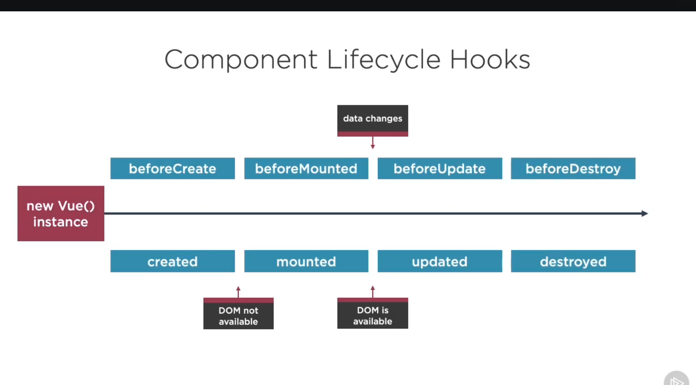
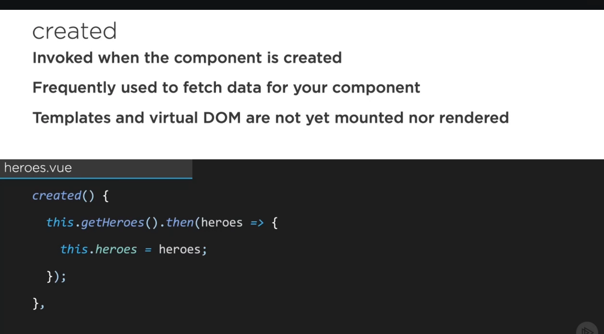
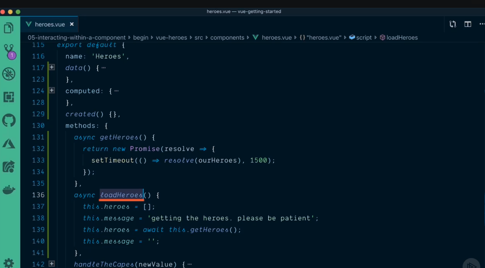
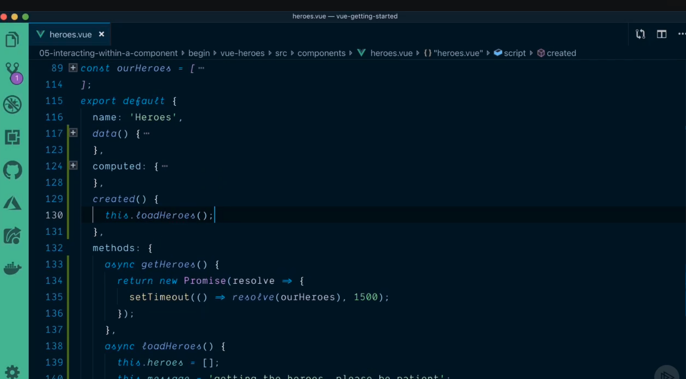
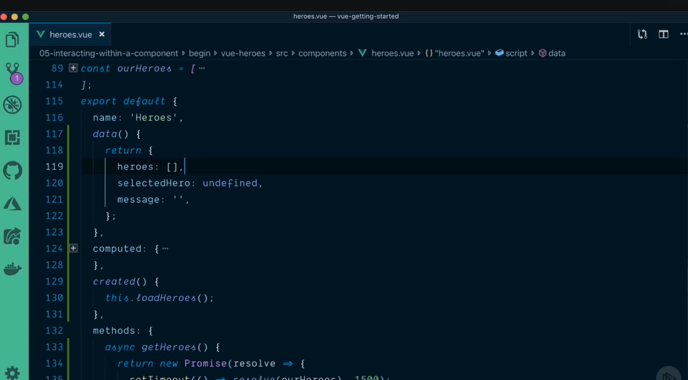

## 1. Component lifecycle ##

### 1.1 Created and beforeCreate ###
- When vue instance is created the first hook that will be set are beforeCreate and created. 
- At this point we can go and hit third party API or API to get the data with created life cycle hook. 
- At this point dom is not available so we can't do anything with DOM.

#### 1.1.1 Example of using async with created ####
- Create async method inside method

- Call asyc from created section

### 1.2 beforeMounted and mounted ###
- Mounted life cycle hook is used to interact with third party components such component not built for vue such as Jquery UI, Old JavaScript
- Then mount that to the DOM

### 1.3 updated and beforeUpdate  ###
- When data changes then updated or beforeUpdate hooks will be in scene

