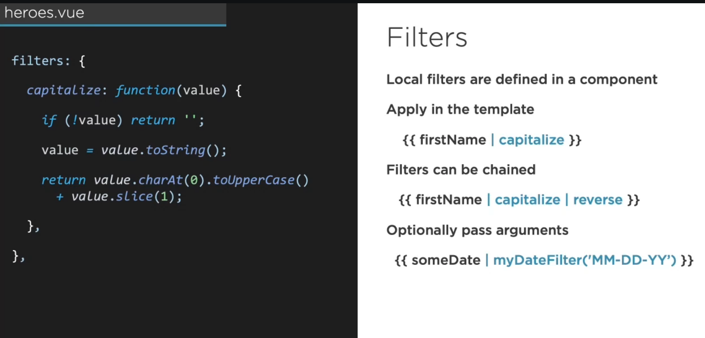
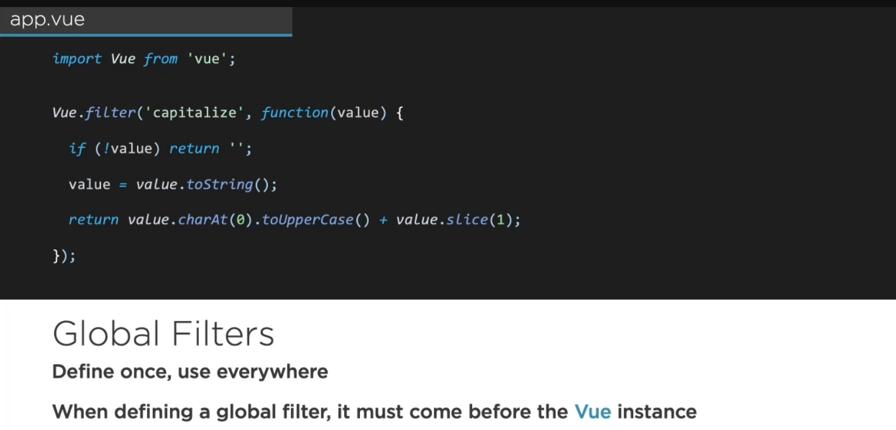
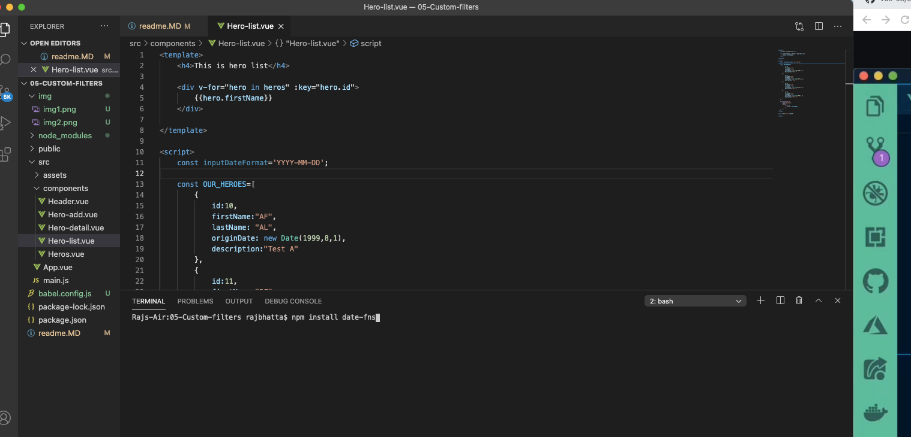
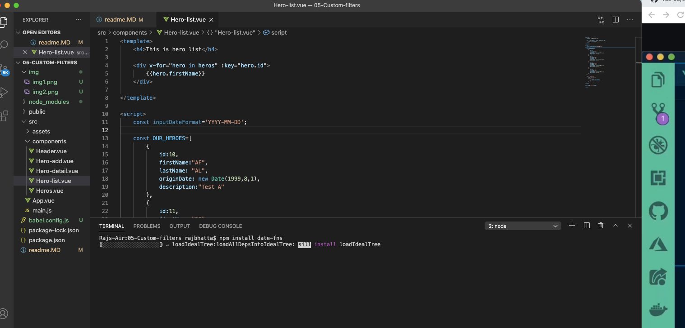
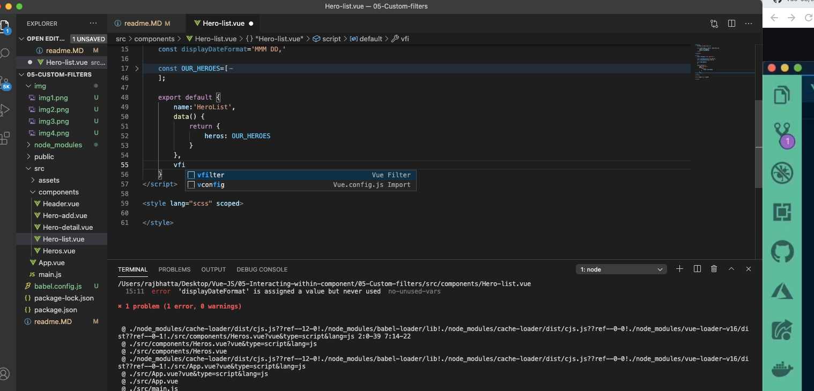

## Custom filter in VueJs ##
- allows you to define filters that can be used to apply common text formatting. A couple examples would be formatting a number to display as currency or creating a filter to capitalize the first word of a string.


<br/>



# 1. Install dependency #

<br/>



```js
<template>
    <h4>This is hero list</h4>
    
    <div v-for="hero in heros" :key="hero.id">
        {{hero.firstName}}
        {{hero.originDate}}
    </div>

</template>

<script>
    import {format} from 'date-fns';

    const inputDateFormat='YYYY-MM-DD';

    const OUR_HEROES=[
        {
            id:10,
            firstName:"AF",
            lastName: "AL",
            originDate: format(new Date(1999,8,1),inputDateFormat),
            description:"Test A"
        },
        {
            id:11,
            firstName:"BF",
            lastName: "BL",
            originDate: format(new Date(1997,8,1),inputDateFormat),
            description:"Test B"
        },
        {
            id:12,
            firstName:"CF",
            lastName: "CL",
            originDate: new Date(1995,8,1),
            description:"Test C"
        },
        {
            id:13,
            firstName:"DF",
            lastName: "DL",
            originDate: format(new Date(1996,8,1),inputDateFormat),
            description:"Test D"
        }
    ];

    export default {
        name:'HeroList',
        data() {
            return {
                heros: OUR_HEROES
            }
        },
    }
</script>

<style lang="scss" scoped>

</style>
```

# 2. Now date formatter #

```js
<template>
    <h4>This is hero list</h4>
    
    <div v-for="hero in heros" :key="hero.id">
        {{hero.firstName}}
        {{hero.originDate / shortDate}}
    </div>

</template>

<script>
    import {format} from 'date-fns';

    const inputDateFormat='YYYY-MM-DD';
    const displayDateFormat='MMM DD,'

    const OUR_HEROES=[
        {
            id:10,
            firstName:"AF",
            lastName: "AL",
            originDate: format(new Date(1999,8,1),inputDateFormat),
            description:"Test A"
        },
        {
            id:11,
            firstName:"BF",
            lastName: "BL",
            originDate: format(new Date(1997,8,1),inputDateFormat),
            description:"Test B"
        },
        {
            id:12,
            firstName:"CF",
            lastName: "CL",
            originDate: new Date(1995,8,1),
            description:"Test C"
        },
        {
            id:13,
            firstName:"DF",
            lastName: "DL",
            originDate: format(new Date(1996,8,1),inputDateFormat),
            description:"Test D"
        }
    ];

    export default {
        name:'HeroList',
        data() {
            return {
                heros: OUR_HEROES
            }
        },
        filters: {
            shortDate: function(value) {
                return format(value,displayDateFormat);
            }
        }
    }
</script>

<style lang="scss" scoped>

</style>
```