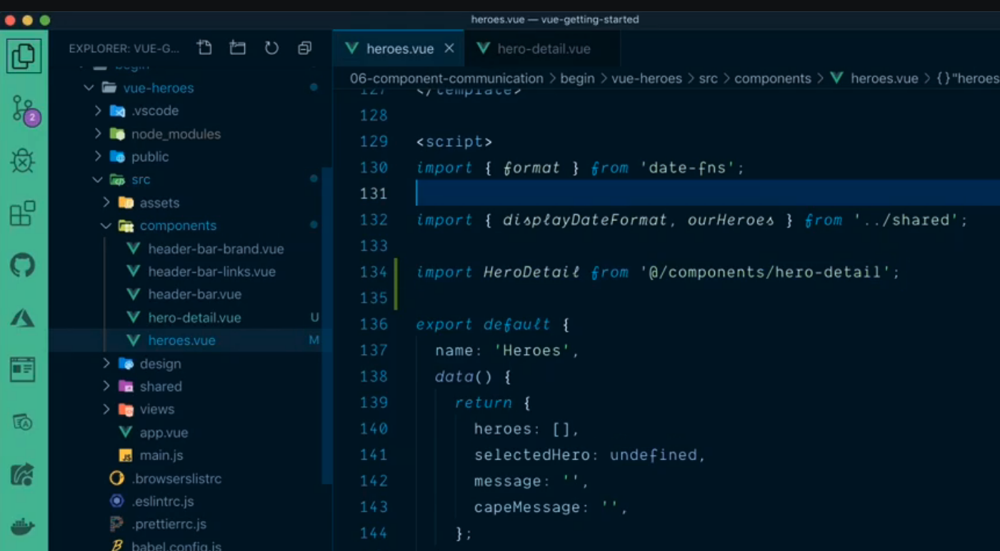

## How to use multiple component inside single component in VueJs ##




- note @/component is the short reference to the component folder

```js
App.vue
<template>
  <Heros></Heros>
</template>

<script>
import Heros from './components/Heros.vue'


export default {
  name: 'App',
  components: {
    Heros
  }
}
</script>
```

- App.vue is using Heros.vue component

```js
Header.vue
<template>
    <div>
        <h2>This is heder part</h2>
    </div>
</template>

<script>
    export default {
        name:'Header'
    }
</script>

<style lang="scss" scoped>

</style>
```


```js
Header-detail.vue
<template>
    <div>
        <h3>This is hero details</h3>
    </div>
</template>

<script>
    export default {
        name:'HeroDetail'
    }
</script>

<style lang="scss" scoped>

</style>
```

```js
Header-list.vue
<template>
    <h4>This is hero list</h4>
</template>

<script>
    export default {
        name:'HeroList'
    }
</script>

<style lang="scss" scoped>

</style>
```

```js
Heros.vue
<template>
    <div>
        <Header></Header>
    </div>
    <div>
        <HeroDetail></HeroDetail>
    </div>
    <div>
        <HeroList></HeroList>
    </div>
</template>

<script>
import Header from './Header.vue'
import HeroDetail from './Hero-detail.vue'
import HeroList from './Hero-list.vue'

    export default {
        name:'Heros',
        components:{Header,HeroDetail,HeroList}
    }
</script>

<style lang="scss" scoped>

</style>
```

- Heros component is using 1) Header.vue 2)Hero-detail.vue and 3)Hero-list.vue thus they are imported
- components registered: (Header.vue , Hero-detail.vue and 3) Hero-list)

```js
export default {
        name:'Heros',
        components:{Header,HeroDetail,HeroList}
    }
```
- Then they are used as a normal HTML tag inside template 
```html
<template>
    <div>
        <Header></Header>
    </div>
    <div>
        <HeroDetail></HeroDetail>
    </div>
    <div>
        <HeroList></HeroList>
    </div>
</template>
```

Note: Template is mandatory inside component in VueJs
