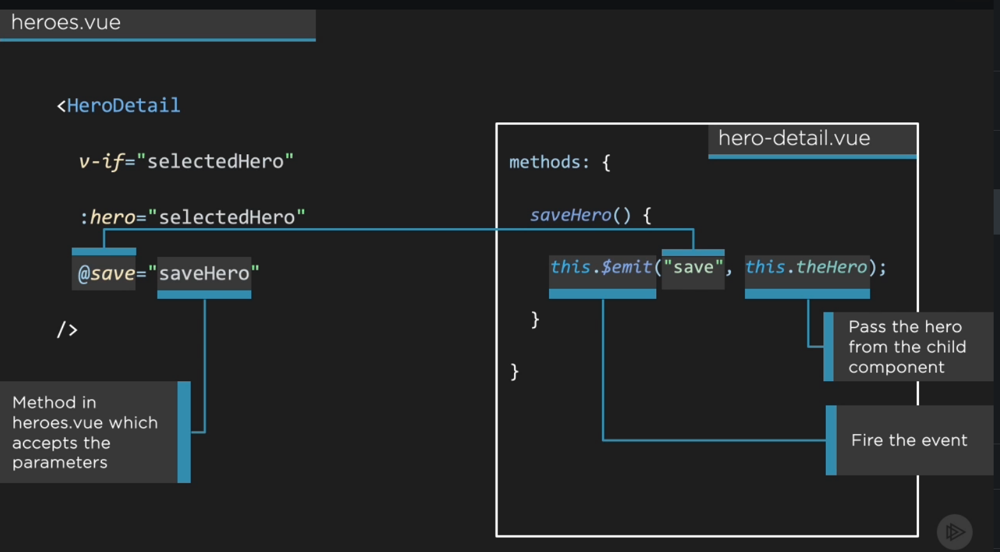

## Passing value from child component to parent component using emit ##
- we can pass value from child component to parent component using <b><span>$emit</span></b>

- You can send data from a child to a parent component by means of Vue’s built-in $emit() method. The first parameter of $emit is the event that should be listened for in the parent component. The second (optional) parameter is the data value to pass.



# Example #
```js

Child Component 

<template>
    <div>
        <span>Hello from child component </span>
        <button type="button" v-on:click="saveHero()">Click</button>
    </div>
</template>

<script>

const OUR_HEROES=
        {
            id:10,
            firstName:"AF",
            lastName: "AL",
            description:"Test A"
        };

    export default {
        name:'HeroList',
        data() {
            return {
                theHero: OUR_HEROES
            }
        },
        methods: {
            saveHero() {
                this.$emit("saveHeroInParent",this.theHero)
            }
        },
    }
</script>

<style lang="scss" scoped>

</style>
```

```js

Parent Component

<template>

    <div>
        <Header></Header>
    </div>
    <div>
        <HeroDetail></HeroDetail>
    </div>
    <div>
        <HeroList @saveHeroInParent="getHeroObjFromChild"></HeroList> 
    </div>

    <h2>Value received from child </h2>
    {{hero.firstName}}
</template>

<script>
import Header from './Header.vue'
import HeroDetail from './Hero-detail.vue'
import HeroList from './Hero-list.vue'

    export default {
        name:'Heros',
        components:{Header,HeroDetail,HeroList},
        data() {
            return {
                hero: {}
            }
        },
        methods: {
            getHeroObjFromChild(passedValue) {
                this.hero=passedValue;
            }
        },
    }
</script>

<style lang="scss" scoped>

</style>
```