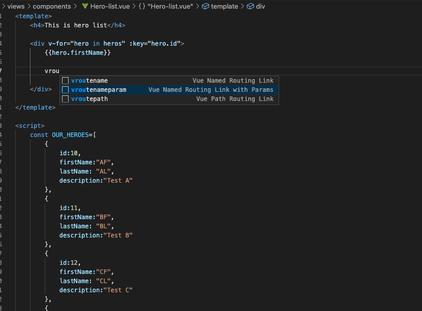

## 1. Router link in VueJs inside the component ##
### 1.1 Add dynamic link with id in router/index.js ###
```js
{
    path: '/herodetail/:id',
    name: 'HeroDetail',
    component: () => import(/* webpackChunkName: "about" */ '../views/components/Hero-detail.vue')
  }
```

### 1.2 Goto details page ###


- This will generate code as given:

```js
 <router-link :to="{name: 'name', params:{id: 'value'} }">LinkTitle</router-link>
```

- where name is the name defined inside router/index.js 

```js
<router-link :to="{name: 'HeroDetail', params:{id: hero.id} }">Click </router-link>
```